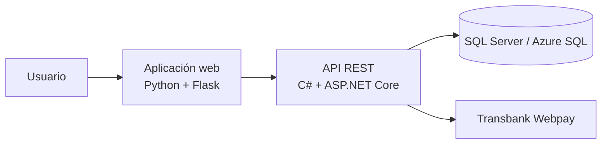

# UniShop — plataforma e-commerce para PyMEs

Proyecto de título de Ingeniería en Informática en Duoc UC. UniShop es una solución web que integra catálogo, clientes, stock, ventas y pagos mediante una aplicación Flask conectada a una API REST en ASP.NET Core.

> Proyecto finalizado y presentado en 2025. La defensa obtuvo un voto de distinción.

## Funcionalidades

- Catálogo web de productos y consulta de disponibilidad.
- Registro de clientes y selección de ubicación y sucursal.
- Gestión de productos, stock y ventas mediante una API REST.
- Inicio y confirmación de pagos con Transbank Webpay.
- Persistencia en SQL Server mediante Entity Framework Core.
- Documentación interactiva de la API con Swagger.

## Arquitectura



## Tecnologías

- **Backend:** C#, .NET 8, ASP.NET Core, Entity Framework Core y Swagger.
- **Aplicación web:** Python, Flask, Jinja, HTML, CSS, JavaScript y Bootstrap.
- **Datos:** SQL Server y Azure SQL Database.
- **Integraciones:** Transbank Webpay.
- **Cloud:** Azure App Service.

## Código fuente

El repositorio conserva las evidencias de las tres fases académicas. El código ejecutable se encuentra en:

```text
Fase 2/Evidencias Proyecto/Evidencias de sistema/
├── Aplicación/
│   ├── ApiFlask/                # Aplicación web
│   └── ApiRest/                 # API ASP.NET Core
└── Base de Datos/UniShopDB.sql  # Script SQL
```

## Ejecución local

### Requisitos

- .NET SDK 8
- Python 3.10 o superior
- SQL Server

### 1. Base de datos

Ejecuta `UniShopDB.sql` en SQL Server. Después configura la conexión mediante una variable de entorno; no agregues contraseñas al repositorio:

```powershell
$env:ConnectionStrings__Connection = "Server=localhost;Database=FerreMasDataBase;Integrated Security=True;TrustServerCertificate=True;"
```

### 2. API REST

```powershell
cd "Fase 2/Evidencias Proyecto/Evidencias de sistema/Aplicación/ApiRest/ApiRest"
dotnet restore
dotnet run
```

La configuración local utiliza `https://localhost:5000`. Swagger está disponible en desarrollo.

### 3. Aplicación Flask

En otra terminal:

```powershell
cd "Fase 2/Evidencias Proyecto/Evidencias de sistema/Aplicación/ApiFlask"
python -m venv .venv
.\.venv\Scripts\Activate.ps1
pip install -r requirements.txt
$env:API_BASE_URL = "https://localhost:5000"
$env:API_VERIFY_SSL = "false" # Solo para el certificado local de desarrollo
python app.py
```

Abre `http://127.0.0.1:5001`.

## Variables de entorno

| Variable | Propósito | Valor local sugerido |
| --- | --- | --- |
| `ConnectionStrings__Connection` | Conexión de la API a SQL Server | Configurar fuera de Git |
| `API_BASE_URL` | URL de la API consumida por Flask | `https://localhost:5000` |
| `API_VERIFY_SSL` | Validación del certificado TLS | `false` solo en desarrollo local |
| `APP_BASE_URL` | URL de retorno utilizada por Webpay | `http://127.0.0.1:5001` |
| `FLASK_DEBUG` | Modo de depuración de Flask | `false` |

Consulta `.env.example` para ver valores de desarrollo sin secretos.

## Seguridad

- Las credenciales y cadenas de conexión deben configurarse mediante variables de entorno o secretos de Azure App Service.
- `API_VERIFY_SSL=false` debe utilizarse únicamente con el certificado local de desarrollo.
- Las credenciales que hayan sido publicadas anteriormente deben revocarse y reemplazarse.

## Contexto académico

Las carpetas `Fase 1`, `Fase 2` y `Fase 3` contienen entregables y evidencias del proceso de título desarrollado durante 2025.

## Autor

Víctor Alejandro Gamboa Blanco

- [LinkedIn](https://www.linkedin.com/in/victor-gamboa-blanco-52882636b/)
- [GitHub](https://github.com/VictorBlanco1997)
